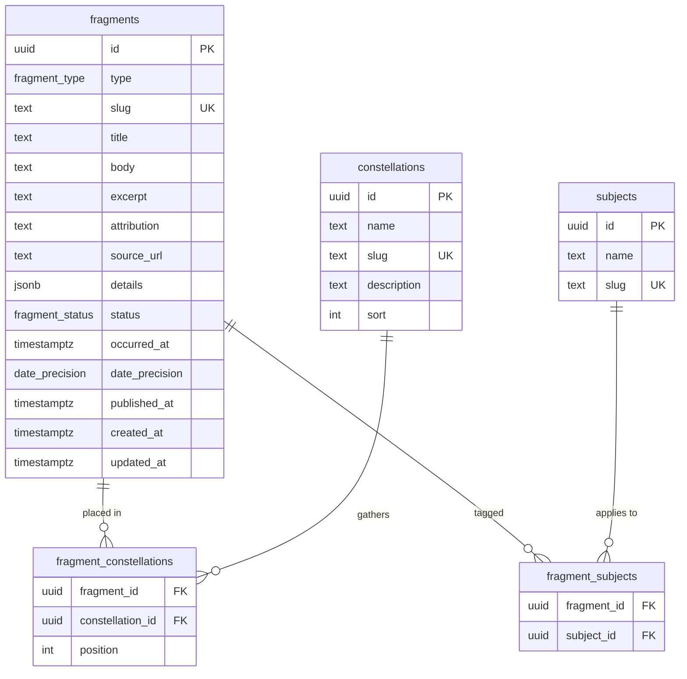

# Data model

*The database schema and how the domain from [`../vision.md`](../vision.md) maps to it. Rendering/auth in [`architecture.md`](architecture.md) / [`auth.md`](auth.md). Rationale in [ADR 0003](adr/0003-fragments-single-table.md).*

---

## 1. The unifying idea

**Everything shareable is a `fragment`.** A post, a quote, a song — one table, three types. Then:

- **The blog** = chronological / filtered *views* over fragments (writing by date; songs; quotes).
- **The Sky** = constellation-grouped views over the fragments that have been *placed*.
- **"Elevation into the Sky" is not a flag** — it is simply *having a row in `fragment_constellations`*. An unplaced fragment lives in the blog forever. (This is the "no placement debt" rule, expressed in the schema.)
- **Links between constellations are emergent** — two constellations are related whenever a fragment belongs to both. There is deliberately **no** fragment-to-fragment link table.

## 2. Entities



## 3. Enums

```sql
create type fragment_type   as enum ('writing', 'quote', 'song');
create type fragment_status as enum ('draft', 'published');
create type date_precision  as enum ('day', 'year');
```

## 4. Tables (DDL)

```sql
-- The atom. Shared columns for all types; type-specific bits in `details`.
create table fragments (
  id             uuid primary key default gen_random_uuid(),
  type           fragment_type   not null,
  slug           text            not null unique,
  title          text,            -- writing/song title; usually null for quotes
  body           text,            -- full essay (Markdown) OR full quote text
  excerpt        text,            -- authored snippet (writing); may be derived if null
  attribution    text,            -- quote author / song artist
  source_url     text,            -- book link / Spotify URL
  details        jsonb           not null default '{}',
  status         fragment_status not null default 'draft',
  occurred_at    timestamptz     not null default now(), -- "the date": posted (writing) / added (song, quote)
  date_precision date_precision  not null default 'day',
  published_at   timestamptz,
  created_at     timestamptz     not null default now(),
  updated_at     timestamptz     not null default now()
);
create index fragments_feed_idx      on fragments (type, status, occurred_at desc);
create index fragments_published_idx on fragments (status, published_at desc);

-- A constellation: a way of seeing, NOT a topic. See vision.md for the distinction.
create table constellations (
  id          uuid primary key default gen_random_uuid(),
  name        text not null,          -- e.g. "conditions, not character"
  slug        text not null unique,
  description text,
  sort        int  not null default 0, -- manual ordering hint (weight is otherwise derived)
  created_at  timestamptz not null default now()
);

-- Placement + composed order. `position` is the authored adjacency (the "suite").
create table fragment_constellations (
  fragment_id      uuid not null references fragments(id)      on delete cascade,
  constellation_id uuid not null references constellations(id) on delete cascade,
  position         int  not null default 0,
  created_at       timestamptz not null default now(),
  primary key (fragment_id, constellation_id)
);
create index fragment_constellations_order_idx
  on fragment_constellations (constellation_id, position);

-- What a fragment is ABOUT (leadership, faith, …). The orthogonal axis to constellations.
-- `definition` (added 0003) is the taxonomy's meaning — the DB is now the single
-- source of truth the AI subject-suggester reads.
create table subjects (
  id         uuid primary key default gen_random_uuid(),
  name       text not null,
  slug       text not null unique,
  definition text,
  created_at timestamptz not null default now()
);

create table fragment_subjects (
  fragment_id uuid not null references fragments(id) on delete cascade,
  subject_id  uuid not null references subjects(id)  on delete cascade,
  primary key (fragment_id, subject_id)
);

-- PROVENANCE (added 0003): where a fragment comes from. The orthogonal axis to
-- subjects (what it's ABOUT). Both optional; essays have neither.
create table authors (
  id uuid primary key default gen_random_uuid(),
  name text not null, slug text not null unique,
  sort_name text, note text, created_at timestamptz not null default now()
);
create table works (
  id uuid primary key default gen_random_uuid(),
  title text not null, slug text not null unique,
  author_id uuid references authors(id) on delete set null,  -- a work belongs to an author
  year int, kind text, created_at timestamptz not null default now()
);
-- Fragments carry author_id/work_id as QUERY FACETS only (on delete set null):
--   alter table fragments add column author_id uuid references authors(id) on delete set null;
--   alter table fragments add column work_id   uuid references works(id)   on delete set null;
```

**Display vs. query — the Bible rule.** `author_id` / `work_id` are *facets for grouping and search*, kept separate from what's **shown** (`attribution` / `details.source_title`). So a scripture verse **displays** "Matthew 5:43-48" (from `attribution`) while **grouping** under the work "The Bible" (`work_id`) — the collection name never leaks into the presented text. "All Bible verses" = `where work_id = <the-bible>`; "everything by Ocean Vuong" = `where author_id = <vuong>`. Managed at [`/admin/library`](admin.md).

`updated_at` is maintained by a standard `moddatetime` trigger on `fragments`.

## 5. The `details` JSONB, per type

Type-specific fields that don't deserve their own columns:

| type | `details` shape |
|---|---|
| `song` | `{ "spotify_id": "…", "album": "…" }` |
| `quote` | `{ "source_title": "Meditations", "source_author": "Marcus Aurelius", "work_year": 170, "page": 12 }` |
| `writing` | `{ "reading_minutes": 6 }` (may instead be computed from `body` at render) |

Kept in JSONB because the type set is small and stable, and these fields are rarely queried on. Anything that becomes a filter/sort target should graduate to a real column.

## 6. Field semantics

- **`slug`** — URL identity (`/blog/forgiveness`). Unique across all fragments.
- **`occurred_at` + `date_precision`** — the *public* date, driving the `Timestamp` component. `writing` → the *posted* date (`day`); `song`/`quote` → *provenance* (often `year`). Verb ("Posted"/"Added") is presentation-only, chosen by type. For `writing` it is **set automatically to the publish moment on first publish**; the composer only exposes it as an optional override for backdating legacy posts (see [admin.md](admin.md) §5). It is distinct from the three **system-maintained audit timestamps**, which are never hand-edited: `created_at` (row created), `published_at` (first went live; stamped once, kept on unpublish), `updated_at` (last edit, via the `moddatetime` trigger).
- **`status`** — `draft` fragments are visible only to the admin (enforced by RLS). Publishing sets `status='published'` and `published_at`.
- **`deleted_at`** — soft delete (migration `..._soft_delete.sql`). "Delete" sets it and the fragment moves to the admin **Trash** (restorable); public reads exclude `deleted_at is not null`; the admin still sees trashed rows. A "purge" is a real `DELETE`. Keeps years of writing recoverable.
- **`excerpt`** — the authored snippet the card shows for `writing`; if null, derive from the first ~160 chars of `body`.
- **`position`** (join) — the composed order of a fragment within a given constellation. A fragment can sit at different positions in different constellations.

## 7. Derived data (not stored)

- **Constellation weight** — `count` of *published* members (for size/brightness in the Sky). A view or query, not a column, so it can't drift out of sync.
- **Reading time** — from `body` word count if not stored in `details`.

## 8. Domain → schema mapping

| `vision.md` term | Schema |
|---|---|
| Fragment (atom) | `fragments` row |
| Song / Quote / Writing | `fragments.type` |
| Provenance date | `occurred_at` + `date_precision` |
| Constellation | `constellations` row |
| Composed suite / adjacency | `fragment_constellations.position` |
| Placement / elevation | existence of a `fragment_constellations` row |
| Subject (tag) | `subjects` + `fragment_subjects` |
| Author / Work (provenance) | `authors` / `works` + `fragments.author_id` / `work_id` (facets; display stays in `attribution` / `details`) |
| Emergent links between constellations | shared membership (no table) |
| The blog / index | queries over `fragments` by `type` + `occurred_at` |

## 9. Deferred (not in v1)

- **Fusion** (binding two atoms into one inseparable fragment) — `vision.md` calls it a rare editorial move. Model later, likely as a self-referential `fragment_parts` table. Not needed now.
- **View-count / analytics**, **series/collections of posts**, **draft autosave history** — out of scope until wanted.
