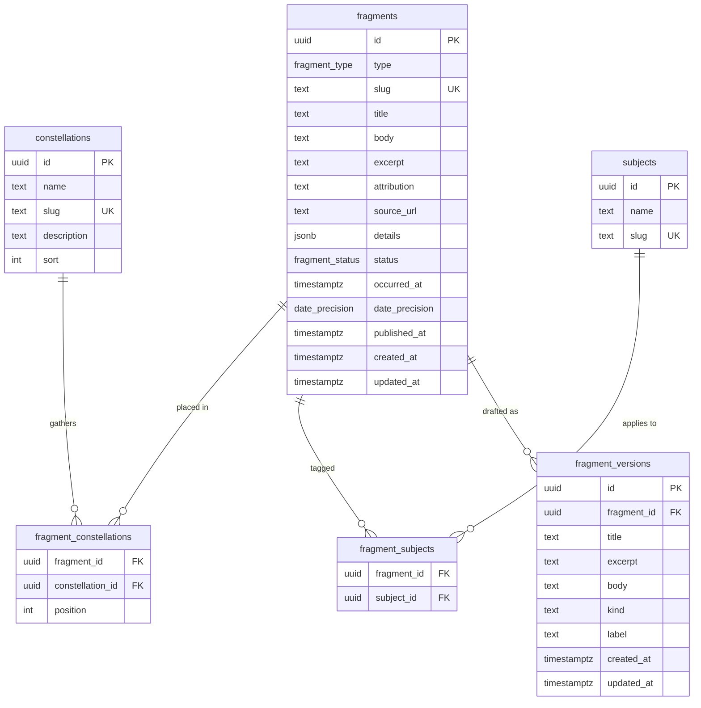

# Data model

*The database schema and how the domain from [`../vision.md`](../vision.md) maps to it. Rendering/auth in [`architecture.md`](architecture.md) / [`auth.md`](auth.md). Rationale in [ADR 0003](adr/0003-fragments-single-table.md).*

---

## 1. The unifying idea

**Everything shareable is a `fragment`.** A post, a quote, a song — one table, three types. Then:

- **The blog** = chronological / filtered *views* over fragments (writing by date; songs; quotes).
- **The Sky** = constellation-grouped views over the fragments that have been *placed*.
- **"Elevation into the Sky" is not a flag** — it is simply *having a row in `fragment_constellations`*. An unplaced fragment lives in the blog forever. (This is the "no placement debt" rule, expressed in the schema.)
- **Links between constellations are emergent** — two constellations are related whenever a fragment belongs to both. There is deliberately **no** fragment-to-fragment link table.

## 2. Entities


```mermaid
erDiagram
  fragments ||--o{ fragment_constellations : "placed in"
  constellations ||--o{ fragment_constellations : "gathers"
  fragments ||--o{ fragment_subjects : "tagged"
  subjects ||--o{ fragment_subjects : "applies to"
  fragments ||--o{ fragment_versions : "drafted as"

  fragments {
    uuid id PK
    fragment_type type
    text slug UK
    text title
    text body
    text excerpt
    text attribution
    text source_url
    jsonb details
    fragment_status status
    timestamptz occurred_at
    date_precision date_precision
    timestamptz published_at
    timestamptz created_at
    timestamptz updated_at
  }
  constellations {
    uuid id PK
    text name
    text slug UK
    text description
    int sort
  }
  fragment_constellations {
    uuid fragment_id FK
    uuid constellation_id FK
    int position
  }
  subjects {
    uuid id PK
    text name
    text slug UK
  }
  fragment_subjects {
    uuid fragment_id FK
    uuid subject_id FK
  }
  fragment_versions {
    uuid id PK
    uuid fragment_id FK
    text title
    text excerpt
    text body
    text kind
    text label
    timestamptz created_at
    timestamptz updated_at
  }
```

## 3. Enums

```sql
create type fragment_type   as enum ('writing', 'quote', 'song');
create type fragment_status as enum ('note', 'draft', 'published');
create type date_precision  as enum ('day', 'year');
```

`'note'` was added 2026-07-30 **before** `'draft'`, not appended — enum sort
order is what pins the least-finished work to the top of the Fragment Manager
(`.order('status')`), so the list reads in the same order the pipeline runs:
note → draft → published. Ordering can't be changed later without recreating
the type. See [admin.md](admin.md) §5b.

## 4. Tables (DDL)

```sql
-- The atom. Shared columns for all types; type-specific bits in `details`.
create table fragments (
  id             uuid primary key default gen_random_uuid(),
  type           fragment_type   not null,
  slug           text            not null unique,
  title          text,            -- writing/song title; usually null for quotes
  body           text,            -- Markdown: full essay / full quote text /
                                  -- a song's annotation, the "why" (ADR-0009)
  excerpt        text,            -- authored snippet (writing); may be derived if null
  attribution    text,            -- quote author / song artist
  source_url     text,            -- book link / Spotify or YouTube URL (canonical, no ?si=)
  paired_song_id uuid references fragments(id) on delete set null,
                                  -- an essay's paired song (ADR-0009). SET NULL,
                                  -- never cascade: deleting a song must not take
                                  -- the essay with it.
  details        jsonb           not null default '{}',
  status         fragment_status not null default 'draft',
  occurred_at    timestamptz     not null default now(), -- "the date": posted (writing) / added (song, quote)
  date_precision date_precision  not null default 'day',
  published_at   timestamptz,
  created_at     timestamptz     not null default now(),
  updated_at     timestamptz     not null default now()
);
create index fragments_feed_idx      on fragments (type, status, occurred_at desc);
create index fragments_published_idx on fragments (status, published_at desc);

-- A constellation: a way of seeing, NOT a topic. See vision.md for the distinction.
create table constellations (
  id          uuid primary key default gen_random_uuid(),
  name        text not null,          -- e.g. "conditions, not character"
  slug        text not null unique,
  description text,
  sort        int  not null default 0, -- manual ordering hint (weight is otherwise derived)
  created_at  timestamptz not null default now()
);

-- Placement + composed order. `position` is the authored adjacency (the "suite").
create table fragment_constellations (
  fragment_id      uuid not null references fragments(id)      on delete cascade,
  constellation_id uuid not null references constellations(id) on delete cascade,
  position         int  not null default 0,
  created_at       timestamptz not null default now(),
  primary key (fragment_id, constellation_id)
);
create index fragment_constellations_order_idx
  on fragment_constellations (constellation_id, position);

-- What a fragment is ABOUT (leadership, faith, …). The orthogonal axis to constellations.
-- `definition` (added 0003) is the taxonomy's meaning — the DB is now the single
-- source of truth the AI subject-suggester reads.
create table subjects (
  id         uuid primary key default gen_random_uuid(),
  name       text not null,
  slug       text not null unique,
  definition text,
  created_at timestamptz not null default now()
);

create table fragment_subjects (
  fragment_id uuid not null references fragments(id) on delete cascade,
  subject_id  uuid not null references subjects(id)  on delete cascade,
  primary key (fragment_id, subject_id)
);

-- PROVENANCE (added 0003): where a fragment comes from. The orthogonal axis to
-- subjects (what it's ABOUT). Both optional; essays have neither.
create table authors (
  id uuid primary key default gen_random_uuid(),
  name text not null, slug text not null unique,
  sort_name text, note text, created_at timestamptz not null default now()
);
create table works (
  id uuid primary key default gen_random_uuid(),
  title text not null, slug text not null unique,
  author_id uuid references authors(id) on delete set null,  -- a work belongs to an author
  year int, kind text, created_at timestamptz not null default now()
);
-- Fragments carry author_id/work_id as QUERY FACETS only (on delete set null):
--   alter table fragments add column author_id uuid references authors(id) on delete set null;
--   alter table fragments add column work_id   uuid references works(id)   on delete set null;
```

**Display vs. query — the Bible rule.** `author_id` / `work_id` are *facets for grouping and search*, kept separate from what's **shown** (`attribution` / `details.source_title`). So a scripture verse **displays** "Matthew 5:43-48" (from `attribution`) while **grouping** under the work "The Bible" (`work_id`) — the collection name never leaks into the presented text. "All Bible verses" = `where work_id = <the-bible>`; "everything by Ocean Vuong" = `where author_id = <vuong>`. Managed at [`/admin/library`](admin.md).

`updated_at` is maintained by a standard `moddatetime` trigger on `fragments`.

## 5. The `details` JSONB, per type

Type-specific fields that don't deserve their own columns:

| type | `details` shape |
|---|---|
| `song` | `{ "spotify_id": "…", "album": "…", "thumbnail_url": "…", "release_year": 2022, "spotify_album_id": "…", "spotify_artist_ids": ["…"] }` — `spotify_id` is a **track or album** id parsed from `source_url` (the one source of truth for both id and kind); a YouTube citation carries `youtube_id` instead. The three Web-API fields arrived with plan 04 Piece 4 and are absent on anything saved before it. `release_year` is the **album's** year and is deliberately not `occurred_at`, which on a song means the year *you added it*. |
| `quote` | `{ "source_title": "Meditations", "source_author": "Marcus Aurelius", "work_year": 170, "page": 12 }` |
| `writing` | `{ "reading_minutes": 6 }` (may instead be computed from `body` at render). Also `{ "media": { "provider": "spotify", "url": "…" } }` on **2 imported rows** — the legacy paired-media shape from Squarespace, superseded by `paired_song_id`. Nothing in the app writes it; see §6 `paired_song_id`. |

Kept in JSONB because the type set is small and stable, and these fields are rarely queried on. Anything that becomes a filter/sort target should graduate to a real column.

## 6. Field semantics

- **`slug`** — URL identity (`/blog/forgiveness`). Unique across all fragments.
- **`occurred_at` + `date_precision`** — the *public* date, driving the `Timestamp` component. `writing` → the *posted* date (`day`); `song`/`quote` → *provenance* (often `year`). Verb ("Posted"/"Added") is presentation-only, chosen by type. For `writing` it is **set automatically to the publish moment on first publish**; the composer only exposes it as an optional override for backdating legacy posts (see [admin.md](admin.md) §5). It is distinct from the three **system-maintained audit timestamps**, which are never hand-edited: `created_at` (row created), `published_at` (first went live; stamped once, kept on unpublish), `updated_at` (last edit, via the `moddatetime` trigger).
- **`status`** — a linear tier, `note → draft → published`. `note` and `draft` are visible only to the admin, enforced by RLS: `fragments_select_published` is an **allowlist** on `status = 'published'`, so a tier added below the line is private by construction and can never leak by omission. Publishing sets `status='published'` and `published_at`; `published_at` is never cleared afterwards, so demoting a piece back to a note keeps the historical "first went live". See [admin.md](admin.md) §5b.
- **`deleted_at`** — soft delete (migration `..._soft_delete.sql`). "Delete" sets it and the fragment moves to the admin **Trash** (restorable); public reads exclude `deleted_at is not null`; the admin still sees trashed rows. A "purge" is a real `DELETE`. Keeps years of writing recoverable.
- **`excerpt`** — the authored snippet the card shows for `writing`; if null, derive from the first ~160 chars of `body`.
- **`position`** (join) — the composed order of a fragment within a given constellation. A fragment can sit at different positions in different constellations.
- **`paired_song_id`** — *the song that goes with this piece* ([ADR 0009](adr/0009-music-three-roles.md)'s third role, built 2026-07-31). A self-FK from a `writing` row to a `song` row, rendered at the head of the essay. **`ON DELETE SET NULL`** — deleting a song blanks the pairing rather than taking the essay with it. The FK deliberately does *not* enforce `type = 'song'`: a composite FK on `(id, type)` would need a generated column holding the constant, and a generated column cannot be set to null, which is precisely what SET NULL must do — so the check lives in the `songs.pair` action, where the error can be a sentence. **RLS needs no help here:** a PostgREST embed re-applies the fragments policies, so an unpublished paired song simply doesn't come back. The reader that consumes this (`pairedMediaOf`) must therefore treat "id set, embed null" as *no pairing* and never fall through to the legacy `details.media`, which all 48 promoted essays still carry.
- **`fragment_versions.kind`** — `working` (one per fragment, enforced by a partial unique index; the autosave target for a published piece) or `snapshot` (a preserved past state, written automatically by every promote). A version carries **words only** — title, excerpt, body — so promoting rewrites a piece without moving its slug, dates, status, subjects or placements. The table has **no `anon` policy at all**, which is why an unfinished rewrite can't leak even through a forgotten join. See [admin.md](admin.md) §5a.

## 6b. HQ — the private second domain

**HQ tables are not fragments and never become them** ([ADR 0012](adr/0012-hq-is-a-private-second-domain.md)). The corpus is authored to be *published*, so its RLS is an allowlist on `status = 'published'`; HQ is authored to be *never seen*, and its safety comes from a different property entirely — **the absence of any `anon` policy at all**, the pattern `fragment_versions` already uses (§6). Every HQ table is `is_admin()` for all four verbs, with no `anon` grant, so no public route can read one even by accident.

**`settings`** — one row, enforced by `id boolean primary key check (id)`. It holds `home_timezone`, an **IANA name** (`America/Los_Angeles`), never an offset: DST is then Postgres's problem and `Intl`'s rather than ours, and a hard-coded `-08:00` is wrong for half of every year. It lives in the database rather than in env so that moving cities is one `UPDATE` and not a redeploy — and so that server-side work with no browser agrees with what the screen says. [`src/lib/hq/time.ts`](../src/lib/hq/time.ts) is the only thing that reads it, and `localToday()` is the only way anything computes "today".

**`daily_checkins`** — one upserted row per local wake date ([admin.md](admin.md) §11).

| Column | Shape | Why |
|---|---|---|
| `log_date` | `date`, **unique** | The local date you woke up on. Going to bed at 1am and waking at 8am the same morning is **one** record. Postgres has no notion of "today", so this column is the only thing that does — never derive it from `created_at`. |
| `bed_at` / `woke_at` | `timestamptz` | Full instants, not times, so the cross-midnight case is unambiguous rather than inferred. A bed time later on the clock than the wake time belongs to the day before. |
| `sleep_latency` | enum bucket | A minute count is a guess at 7am; a bucket is honest and just as useful for a trend. |
| `awakenings` | enum bucket | Same reason — nobody knows the count. |
| `sleep_quality` · `restedness` | two `smallint` 1–5 | **Two fields on purpose, and they must not be merged.** Physical rest and mental rest come apart, and one combined score erases exactly the case worth noticing. |
| `valence` · `arousal` | two `smallint` 1–5 | **Two axes, not one mood score.** A single scale cannot distinguish *calm but hollow* from *wired and afraid*. |
| `dream_recall` | enum, 4 values | `none` is one tap and is **real data**, not a hole. |
| `dream_intensity` · `dream_body` | 1–5, Markdown | Guarded by a CHECK: they cannot outlive the dream they describe. |
| `note` | text | One optional line of anything. |
| `skipped` | `boolean not null` | **Recorded, never inferred.** A row with `skipped = true` means "not today"; no row at all means nothing was said. Neither is ever counted, and there are no streaks anywhere in HQ. |

**Every field except `log_date` is nullable, and that is the design.** The check-in is not a form that gets submitted: the phone captures times and ratings on waking, a desktop appends the longer text later, and both are the same row. An unfinished check-in is a check-in — there is no completeness meter and there must not be one.

Writes are bounded to a **three-day backfill window**, enforced in [`src/actions/checkin.ts`](../src/actions/checkin.ts) rather than only in the form. That is a data-quality limit, not a convenience one: affect recalled a week later is invention, and an invented row is worse than an absent one because a trend cannot tell them apart.

**`people`** — the roster ([admin.md](admin.md) §12). A person is a **first-class entity**: its own table, its own room and its own full page, not a tag over fragments. The roster's working size is ~25 with a ceiling of 50, and several decisions below only make sense at that size.

> **⚠ This table is deliberately bounded in what it may hold**, and the bound is a design constraint rather than a habit: *"I only write nice things about people and have no business putting deeply personal or sensitive info about anyone."* That is what makes the nightly backup and the widened `/admin/export.json` safe with no exclusion and no separate encryption — anything that would make a leak genuinely harmful is out of scope **by design**. It only stays true if it is defended at the schema, so: **no health field, no "concerns", no conflict log, no ratings, no sentiment.** A later migration that adds their opposite has broken something it cannot see.

| Column | Shape | Why |
|---|---|---|
| `slug` | `text`, **unique** | The profile URL. **Minted once and never re-minted** — a rename ("Kate" becomes "Mum", a surname changes) must not move a page that is already in browser history. |
| `display_name` | `text not null` | What he *calls* them, which is the name in every heading. `full_name` and `sort_name` exist beside it for the formal name and for ordering. |
| `circle` | enum, 3 values | `family · friends · professional`. **One field, not two.** Relationship kind and closeness are genuinely different axes, and splitting them at 25 people is structure that never gets used. There is **no `acquaintances`** value, and its absence is a statement rather than a simplification: it would be the only bucket defined by neglect. Someone who has genuinely fallen out of your life is archived, not demoted. |
| `epithet` | `text` | The one hand-written line on the card — *"college roommate, now in Seattle"*. Not a bio; that is `bio`. |
| `birth_month` · `birth_day` · `birth_year` | three `smallint`, the year **nullable** | Never a `date` with a sentinel year. The year is frequently unknown; the "next 30 days" question is a month/day computation anyway (mind the December→January wrap); and a sentinel year is the kind of thing that silently becomes somebody's age on a screen. Three CHECKs enforce that month and day travel together, that a lone year is refused, and that **31 April cannot be stored** — while 29 February can, because a leap-day birthday is real. |
| `birthday_lead_days` | `int`, default **30** | Per person. Thirty, not seven: *"happy birthday on time"* for the people who matter means weeks of warning, because choosing and shipping a gift takes them. A week is enough to send a message and nothing else. |
| `cadence_days` | `int`, default **365** | Drift is **on by default for everyone**. A year is long enough that being told is a favour rather than a scold; the same design would not be defensible at 30 days. Entered in the UI in *months* — the conversion is 365.25/12 so that 12 ⇄ 365 round-trips exactly and saving an untouched form cannot move it. |
| `drift_muted_until` | `date` | *"This is fine"* — some relationships genuinely are annual. Set to today + that person's own cadence, **counted from today** rather than from the last contact, which would expire the moment you pressed it. |
| `drift_mutes` | `smallint`, default 0 | How many times that has been said. The count accrues now; **the UI that reads it does not exist yet** — at a one-year cadence a second mute cannot happen before 2028, and building against a rule nothing can exercise is worse than waiting. Starting the count later would mean starting it at zero on the day it mattered. |
| `photo_path` | `text` | An object path in the **private `hq` bucket**, never a URL: the only URLs that bucket has are signed and they expire (§7c of the HQ plan). Sign at render, never persist. |
| `archived_at` | `timestamptz` | **Explicit only, never automatic**, however long the silence. It removes somebody from the roster and from search while keeping every row. Since there is no `acquaintances` tier, this is the *only* way somebody leaves the roster. |

`last_contact_at` is **derived, never stored** (§7) — and note what it is derived *from*: interactions only. `people.updated_at` is deliberately not part of it, because fixing a typo in someone's record is not evidence you were in touch with them, and letting it silence a one-year notice would defeat the feature by the most trivial possible action.

**No `contacts` column, and its absence is a decision.** Phone and email already live on his phone, backed up elsewhere. A second copy buys one saved tap and guarantees it goes stale — and a stale number is worse than no number, because you act on it.

**No indexes beyond the primary key and the unique slug.** At a ceiling of 50 rows Postgres will sequential-scan whatever we build, and an unused index is a thing that has to be maintained and explained.

**`interactions` + `interaction_people`** — the log ([admin.md](admin.md) §12).

> **⚠ An interaction has PARTICIPANTS, not an owner.** One dinner with three friends is **one row appearing on three profiles**. A `person_id` column on `interactions` would force writing it three times or losing two of the three records — and it would destroy the group dimension, which the join gives for free: who you actually see together, and who you only ever see through somebody else.

| Column | Shape | Why |
|---|---|---|
| `occurred_on` | **`date`**, not null, **no default** | A local date, because every consumer asks a local-date question — "3 weeks ago", `now - last_contact > cadence_days`, the brief's *Last contact*. A `timestamptz` would make every reader redo a zone conversion, which is where the cross-midnight bug class starts. **And no default:** `current_date` evaluates on a server whose clock is UTC, so an entry logged at 5pm in California would silently be dated tomorrow. The action supplies it through `localToday()`. |
| `kind` | enum, 6 values | `hangout · call · message · gift · shared · note`. `gift` prevents repeat presents and informs the next one; `shared` covers a recommendation that never became a fragment. Entry kinds, not separate tables. |
| `body` | `text not null`, non-blank | An entry with no words is not an entry — it is a row that will mean nothing to you in three years, which is the span this table exists to survive. |

**No `title`, and no `location`.** A title is a second decision before you have written the first word, and the whole design target is fifteen seconds. Where you were is either irrelevant or part of the story, and then it belongs in the words — a structured field would be empty on most rows and would invite filtering by something nobody filters by.

**`person_last_contact` is a VIEW, not a column** — `max(occurred_on)` and a count, grouped by person. A stored copy would drift every time an entry was edited, deleted or backdated.

> **⚠ `security_invoker = true` on that view is load-bearing.** A Postgres view runs with its **owner's** privileges by default, so without it the view would read `interactions` as the owner and hand the results to whoever asked — bypassing every policy above and turning the one derived surface into a leak. With it, the view sees exactly what the caller may see; for `anon`, nothing. Verified against live PostgREST as a genuinely signed-out client.

**`person_works` + `person_fragments`** — the one seam with the corpus ([admin.md](admin.md) §12). Everywhere else the boundary is absolute: HQ data never becomes corpus data, and a log entry is never promoted into an essay. These two tables are the exception, and they are shaped so it leaks in one direction only — they **reference** public rows and are themselves entirely private.

> **⚠ Two tables, not one `person → fragment` join, and the reason is the whole payoff.** The link that matters is **person → work → fragments**, a two-hop path over `works`, which already exists (§4). Linking somebody to a book once means every fragment carrying that `work_id` appears on their profile **automatically, including ones added years later**. Tagging each quote by hand gives the same page today and a stale one in a year.

| Table | Key | Why |
|---|---|---|
| `person_works` | `(person_id, work_id)` | The two-hop link. Resolved at read time, never materialised — see above. |
| `person_fragments` | `(person_id, fragment_id)` | The direct edge, for what that path cannot reach: a song somebody sent, a line they said out loud that never came from a book. |

Both carry an optional free-text `note` (*"recommended, Mar 2024"*) and **no enum of link kinds**. "Recommended" / "gave me" / "we read it together" is a taxonomy that looks right on paper and is wrong after a month; the note holds the nuance until a pattern actually emerges. There is **no `person_authors`** — plausible, weaker, largely derivable from the works already linked, and deferred until it earns itself.

`person_fragments` is indexed on `fragment_id`, because the editor's *Shared by* field asks the reverse question on every open. `person_works` gets no matching index: nothing asks "who recommended this work?", because there is no work page to ask it from.

> **⚠ These tables have no `anon` policy, and the guarantee is stronger than that.** A published quote stays public; **the fact that somebody is why it exists is HQ data** — not the note, not the count, not the existence of the row. The second half is not written in SQL: **public queries never touch these tables at all**, so there is no join for a policy to have to get right. Verified as a genuinely signed-out client, directly and **through an embedded join from a public `fragments` row**.

**`tasks` + `task_events`** — the agenda ([admin.md](admin.md) §13, [ADR 0013](adr/0013-absence-never-accumulates.md)). Personal only; work lives on the company's platform.

> **⚠ A RECURRENCE IS A RULE PLUS ONE MATERIALISED DATE, and a row is written only when a task is DISPOSED OF.** This is where ADR 0013 stops being a principle and becomes a shape: the conventional design materialises future occurrences and then hides, rolls, or bulk-dismisses the ones that passed, which is safety by discipline — every subsequent query, export, backup and "show all" view is one forgotten filter away from the wall. Forty-seven overdue rows cannot be rendered here because forty-seven rows were never created.

| Column | Shape | Why |
|---|---|---|
| `due_on` + `due_time` | `date` + **nullable** `time` | Two columns, never one `timestamptz`. "Clean the bathroom Saturday" and "call the bank at 4:30 Tuesday" are different things, and a single timestamp gives every date-only task a midnight deadline that is wrong and then has to be hidden. Nullable time keeps *sometime that day* honest — and a date-only task must not shift when you travel. A null `due_on` is the **Unscheduled** list: a permanently valid state, not a graveyard. |
| `effort` | enum, 4 values | `quick · sitting · block · project`, named in **time**. It drives **lead** — how far ahead the task surfaces — because how early you need to see something tracks how much runway you need to find the time, not how much it matters. |
| `priority` | enum, 3 values | Drives **prominence** only: weight and ink, never colour. Urgency is the one semantic axis, and a red high-priority task beside a red overdue one makes both meaningless. |
| `lead_days` | `int`, nullable | Null = derive from `effort` (1 / 3 / 7 / 21, bumped one bucket by `high`, never shortened by `low`). Set = an override that always wins. |
| `recur_mode` + `recur_rrule` \| `recur_every`/`recur_unit` | enum + **four columns, not `jsonb`** | The two modes are different kinds of thing, so they store differently: **`fixed`** is an RRULE (RFC 5545 — the language Google speaks, which matters once the calendar mirror exists); **`after_completion`** is a plain interval, deliberately *not* RRULE, because "two weeks after I actually did it" is not a calendar rule and RFC 5545 cannot say it. As columns, a CHECK makes the half-filled state **unrepresentable** — and a half-filled recurrence does not fail loudly, it silently reschedules a chore. |

**The RRULE is always generated server-side from (preset, date)** by [`src/lib/hq/recurrence.ts`](../src/lib/hq/recurrence.ts) — the editor offers six named schedules and posts which one it picked, never a rule string. So the column can only hold rules the expander is known to understand, which is what makes storing the standard string safe without shipping a full RFC 5545 parser to the browser. Nobody hand-writes an RRULE, and nobody can read one either: the editor verifies a rule by showing **the next three dates it actually produces**.

`task_events` is the disposition log — one row per time a task was dealt with, **both outcomes**. A skip is a recorded answer, never inferred from silence: a day the app was not opened must stay distinguishable from a day a chore was deliberately let go, or the adherence signal the mechanism exists to produce is corrupt. It carries `occurred_on` (the day you answered) *and* `for_due_on` (**which occurrence** you answered about) — they differ routinely, and the second is what makes undo exact rather than recomputed by running the rule backwards.

## 7. Derived data (not stored)

- **Constellation weight** — `count` of *published* members (for size/brightness in the Sky). A view or query, not a column, so it can't drift out of sync.
- **Reading time** — from `body` word count if not stored in `details`.
- **Time in bed, estimated sleep, sleep efficiency** — from `daily_checkins.bed_at` / `woke_at` and the two buckets, computed at render by [`src/lib/hq/checkin.ts`](../src/lib/hq/checkin.ts). Efficiency in particular is the number that actually moves under CBT-I, which makes a stale stored copy of it worse than none. The estimate stays null until *both* buckets are answered — an efficiency that silently assumed "asleep instantly, never woke" would be a number the person never gave.
- **Last contact** — `max(occurred_on)` over a person's interactions, served by the `person_last_contact` view. Not a column, so it can never disagree with the entries it summarises. Note what it is derived *from*: interactions only. `people.updated_at` is deliberately excluded — fixing a typo in somebody's record is not evidence you were in touch with them, and letting it silence a one-year notice would defeat the feature by the most trivial possible action. Its two guards belong here too, because both were found by prototyping the *query* rather than the pixels: **drift requires at least one logged interaction** (last contact is null the day somebody is added, and the naive rule would flag the whole roster on creation day), and **anyone with an event today is never drifting**, however long since the last log.
- **Drift** — `now - last_contact > cadence_days`, in [`src/lib/hq/drift.ts`](../src/lib/hq/drift.ts), and deliberately **not a flag anybody can set**. A hand-set column was the people lab's own bug: a person 420 days cold never appeared under *Been a while* because nothing had updated their flag. Ordering is by how far past **their own** cadence, not by raw days — sorting by days would silently override every cadence set by hand. Its two guards are above, and **one of them is currently unenforceable**: "anyone with an event today is never drifting" needs an events table that does not exist yet, so on the morning you are seeing somebody for the first time in a year they will still be listed until you log it.
- **A task's lead, and the date it first surfaces** — `leadFor()` / `leadLine()` in [`src/lib/hq/tasks.ts`](../src/lib/hq/tasks.ts). Effort decides *when*, priority decides *how loud*, an explicit `lead_days` beats both, and `low` never shortens a lead — hiding a warning is not a kindness. Pure functions on local-date strings, so the **same** code runs in the editor (where the sentence has to name a date live) and in the action: a rule computed one way on screen and another on the server is a rule nobody can trust, and this one is invisible until a task fails to appear weeks later.
- **Where a recurring task goes next** — `advance()` in the same file. **Not stored, and not a queue.** `after_completion` counts from the day you *ticked* it, never from the date it was due; `fixed` rolls forward to the first occurrence **strictly after today**, so three weeks away costs one tap rather than four. The occurrences in between leave no rows, because there were never any rows ([ADR 0013](adr/0013-absence-never-accumulates.md)).
- **A person's next birthday** — `nextOccurrence(birth_month, birth_day)` in [`src/lib/hq/dates.ts`](../src/lib/hq/dates.ts). A month/day pair has **no weekday until the occurrence is resolved**, and it rolls to next year the day after it passes. 29 February falls back to 1 March in a common year: celebrating early is wrong, and skipping drops the person off the page three years out of four.

## 8. Domain → schema mapping

| `vision.md` term | Schema |
|---|---|
| Fragment (atom) | `fragments` row |
| Song / Quote / Writing | `fragments.type` |
| Provenance date | `occurred_at` + `date_precision` |
| Constellation | `constellations` row |
| Composed suite / adjacency | `fragment_constellations.position` |
| Placement / elevation | existence of a `fragment_constellations` row |
| Subject (tag) | `subjects` + `fragment_subjects` |
| Author / Work (provenance) | `authors` / `works` + `fragments.author_id` / `work_id` (facets; display stays in `attribution` / `details`) |
| Emergent links between constellations | shared membership (no table) |
| The morning check-in | `daily_checkins`, keyed by local `log_date` (§6b) |
| A person | `people` row (§6b) |
| A logged contact | `interactions` + `interaction_people` — participants, never an owner (§6b) |
| "What they've given me" | `person_works` (two-hop, via `works`) + `person_fragments` (§6b) |
| Drift | derived from `person_last_contact` and `people.cadence_days` (§7) |
| A task, and its chore rule | `tasks` — the rule plus ONE materialised date (§6b) |
| "Did it" / "Skipping it" | a `task_events` row; the only thing that moves a schedule (§6b) |
| The configured home timezone | `settings.home_timezone` (§6b) |
| The blog / index | queries over `fragments` by `type` + `occurred_at` |

## 9. Deferred (not in v1)

- **Fusion** (binding two atoms into one inseparable fragment) — `vision.md` calls it a rare editorial move. Model later, likely as a self-referential `fragment_parts` table. Not needed now.
- ~~**Draft autosave history**~~ — **shipped 2026-07-30** as `fragment_versions` (§6, [admin.md](admin.md) §5a). It stopped being a feature to schedule once editing a published piece was modelled as writing a version rather than mutating a row: history became a consequence rather than an addition.
- **View-count / analytics**, **series/collections of posts** — out of scope until wanted.
