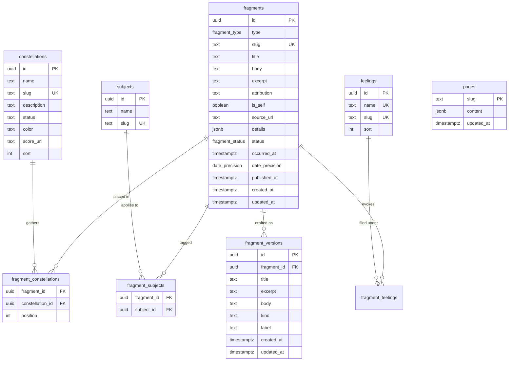

# Data model

*The database schema and how the domain from [`../vision.md`](../vision.md) maps to it. Rendering/auth in [`architecture.md`](architecture.md) / [`auth.md`](auth.md). Rationale in [ADR 0003](adr/0003-fragments-single-table.md).*

---

## 1. The unifying idea

**Everything shareable is a `fragment`.** A post, a quote, a song — one table, three types. Then:

- **The blog** = chronological / filtered *views* over fragments (writing by date; songs; quotes).
- **The Sky** = constellation-grouped views over the fragments that have been *placed*.
- **"Elevation into the Sky" is not a flag** — it is simply *having a row in `fragment_constellations`*. An unplaced fragment lives in the blog forever. (This is the "no placement debt" rule, expressed in the schema.)
- **Links between constellations are emergent** — two constellations are related whenever a fragment belongs to both. There is deliberately **no** fragment-to-fragment link table.
- **There are two vocabularies over fragments, and they run in opposite directions.** A **subject** is what a piece is *about*; a **feeling** is what a song *does to you*. Same register, opposite direction — so `feelings` is its own table rather than `subjects` with a `kind` column. The obvious saving is the wrong one: one table would invite exactly the category error this corpus already made once, when a song was filed under the subject `jazz` — a genre, in a taxonomy of words about living, attached to nothing else. Two tables make that impossible to spell. ([plan 33](plans/33-many-words-for-one-song.md) §1; the migration argues it at length.)

## 2. Entities


```mermaid
erDiagram
  fragments ||--o{ fragment_constellations : "placed in"
  constellations ||--o{ fragment_constellations : "gathers"
  fragments ||--o{ fragment_subjects : "tagged"
  subjects ||--o{ fragment_subjects : "applies to"
  fragments ||--o{ fragment_feelings : "evokes"
  feelings ||--o{ fragment_feelings : "filed under"
  fragments ||--o{ fragment_versions : "drafted as"

  fragments {
    uuid id PK
    fragment_type type
    text slug UK
    text title
    text body
    text excerpt
    text attribution
    boolean is_self
    text source_url
    jsonb details
    fragment_status status
    timestamptz occurred_at
    date_precision date_precision
    timestamptz published_at
    timestamptz created_at
    timestamptz updated_at
  }
  feelings {
    uuid id PK
    text name UK
    text slug UK
    int sort
  }
  constellations {
    uuid id PK
    text name
    text slug UK
    text description
    text status
    text color
    text score_url
    int sort
  }
  pages {
    text slug PK
    jsonb content
    timestamptz updated_at
  }
  fragment_constellations {
    uuid fragment_id FK
    uuid constellation_id FK
    int position
  }
  subjects {
    uuid id PK
    text name
    text slug UK
  }
  fragment_subjects {
    uuid fragment_id FK
    uuid subject_id FK
  }
  fragment_versions {
    uuid id PK
    uuid fragment_id FK
    text title
    text excerpt
    text body
    text kind
    text label
    timestamptz created_at
    timestamptz updated_at
  }
```

## 3. Enums

```sql
create type fragment_type   as enum ('writing', 'quote', 'song');
create type fragment_status as enum ('note', 'draft', 'published');
create type date_precision  as enum ('day', 'year');
```

`'note'` was added 2026-07-30 **before** `'draft'`, not appended — enum sort
order is what pins the least-finished work to the top of the Fragment Manager
(`.order('status')`), so the list reads in the same order the pipeline runs:
note → draft → published. Ordering can't be changed later without recreating
the type. See [admin.md](admin.md) §5b.

## 4. Tables (DDL)

```sql
-- The atom. Shared columns for all types; type-specific bits in `details`.
create table fragments (
  id             uuid primary key default gen_random_uuid(),
  type           fragment_type   not null,
  slug           text            not null unique,
  title          text,            -- writing/song title; usually null for quotes
  body           text,            -- Markdown: full essay / full quote text /
                                  -- a song's annotation, the "why" (ADR-0009)
  excerpt        text,            -- authored snippet (writing); may be derived if null
  attribution    text,            -- the shown line. song: the artist, typed.
                                  -- quote: DERIVED (see §"the three facts"),
                                  -- written by saveQuote on every save.
  is_self        boolean         not null default false,
                                  -- quote: Michael's own words. Silences the
                                  -- line while staying distinguishable from
                                  -- "source unknown", which is also silent.
  source_url     text,            -- book link / Spotify or YouTube URL (canonical, no ?si=)
  paired_song_id uuid references fragments(id) on delete set null,
                                  -- an essay's paired song (ADR-0009). SET NULL,
                                  -- never cascade: deleting a song must not take
                                  -- the essay with it.
  details        jsonb           not null default '{}',
  status         fragment_status not null default 'draft',
  occurred_at    timestamptz     not null default now(), -- "the date": posted (writing) / added (song, quote)
  date_precision date_precision  not null default 'day',
  published_at   timestamptz,
  created_at     timestamptz     not null default now(),
  updated_at     timestamptz     not null default now()
);
create index fragments_feed_idx      on fragments (type, status, occurred_at desc);
create index fragments_published_idx on fragments (status, published_at desc);

-- A constellation: a way of seeing, NOT a topic. See vision.md for the distinction.
create table constellations (
  id          uuid primary key default gen_random_uuid(),
  name        text not null,          -- e.g. "conditions, not character"
  slug        text not null unique,
  description text,
  sort        int  not null default 0, -- manual ordering hint (weight is otherwise derived)
  created_at  timestamptz not null default now(),
  -- The three below arrived in July 2026 and are all load-bearing in the
  -- composing room (admin.md §2). They were missing from this block until
  -- 2026-08-09, which made the DDL here describe a sky with no drafts and no
  -- colour — i.e. one you could not have built the composer against.
  status    text not null default 'draft'
              check (status in ('draft','published')),
              -- A "pile" is just a draft. Drafts never reach the public sky:
              -- `constellations_select_public` is `status = 'published'`, which
              -- is what makes /{slug} a free draft preview for the admin.
  color     text not null default 'amber'
              check (color in ('violet','ice','azure','gold','amber','sand','ember','rose')),
              -- A SLOT, never a raw value — app.css owns what the slot means in
              -- each theme, so design.md's one-palette law survives. A new
              -- constellation auto-takes the least-used slot.
  score_url text  -- the suite's playlist (ADR-0009). A playlist is deliberately
                  -- not a song fragment; it belongs to the constellation.
);
-- ⚠ `status` here is a plain `text` + CHECK, NOT the `fragment_status` enum, and
-- the difference reaches the app: `_shared.ts` splits the Zod schema into
-- `fragmentStatus` and `constellationStatus` so "a constellation that is a note"
-- is refused at the boundary rather than at the database (admin.md §5b).

-- An editable singleton page (About, and later `now` / `colophon`). NOT a
-- fragment: it never appears in a feed, and has no provenance, constellation or
-- subject semantics — which is the whole reason it is its own table rather than
-- a fourth `fragment_type`. Written by the About builder (`actions/site.ts`);
-- `content`'s per-page shape is validated by that action's Zod schema, not by
-- the database. See ADR 0020 for what the About page is now allowed to say.
create table pages (
  slug       text primary key,                  -- 'about', later 'now', 'colophon', …
  content    jsonb not null default '{}'::jsonb,
  updated_at timestamptz not null default now() -- moddatetime trigger
);
-- Security posture mirrors fragments' public metadata: anyone READS a page
-- (there is one, and it is meant to be public); only the admin writes.

-- Placement + composed order. `position` is the authored adjacency (the "suite").
create table fragment_constellations (
  fragment_id      uuid not null references fragments(id)      on delete cascade,
  constellation_id uuid not null references constellations(id) on delete cascade,
  position         int  not null default 0,
  created_at       timestamptz not null default now(),
  primary key (fragment_id, constellation_id)
);
create index fragment_constellations_order_idx
  on fragment_constellations (constellation_id, position);

-- What a fragment is ABOUT (leadership, faith, …). The orthogonal axis to constellations.
-- `definition` (added 0003) is the taxonomy's meaning — the DB is now the single
-- source of truth the AI subject-suggester reads.
create table subjects (
  id         uuid primary key default gen_random_uuid(),
  name       text not null,
  slug       text not null unique,
  definition text,
  created_at timestamptz not null default now()
);

create table fragment_subjects (
  fragment_id uuid not null references fragments(id) on delete cascade,
  subject_id  uuid not null references subjects(id)  on delete cascade,
  primary key (fragment_id, subject_id)
);

-- FEELINGS (added 2026-08-11, plan 33): what a SONG does to you. The opposite
-- direction from a subject, which is what a piece is about — see §1 for why
-- these are two tables and not one with a `kind` column.
create table feelings (
  id         uuid primary key default gen_random_uuid(),
  name       text not null,   -- renameable
  slug       text not null unique,  -- ⚠ FROZEN at creation; it goes in a public URL
  sort       int  not null,   -- the spectrum, dark -> light. Data, not decoration.
  created_at timestamptz not null default now()
);
-- `Tender` and `tender` must not both exist: the room prints the word itself.
create unique index feelings_name_ci on feelings (lower(name));

create table fragment_feelings (
  fragment_id uuid not null references fragments(id) on delete cascade,
  feeling_id  uuid not null references feelings(id)  on delete cascade,
  primary key (fragment_id, feeling_id)
);
-- The room only ever reads this backwards: "which songs carry this feeling".
create index fragment_feelings_feeling_idx on fragment_feelings (feeling_id);

-- PROVENANCE (added 0003): where a fragment comes from. The orthogonal axis to
-- subjects (what it's ABOUT). Both optional; essays have neither.
create table authors (
  id uuid primary key default gen_random_uuid(),
  name text not null, slug text not null unique,
  sort_name text, note text, created_at timestamptz not null default now()
);
create table works (
  id uuid primary key default gen_random_uuid(),
  title text not null, slug text not null unique,
  author_id uuid references authors(id) on delete set null,  -- a work belongs to an author
  year int, kind text, created_at timestamptz not null default now()
);
-- Fragments carry author_id/work_id as QUERY FACETS only (on delete set null):
--   alter table fragments add column author_id uuid references authors(id) on delete set null;
--   alter table fragments add column work_id   uuid references works(id)   on delete set null;
```

**The three facts, and the line derived from them.** A quote stores **Who** (`author_id`, or `is_self`, or neither), **From** (`work_id`) and **Where** (`details.citation` — free text: *Book 2:2*, *John 3:16*, *Letter 24:19–20, p. 19*). Nothing else is a fact. The shown line is a **rendering** of those three, computed by [`src/lib/provenance.ts`](../src/lib/provenance.ts) and written into `attribution` on every save:

> Lead with the Who. With no Who, the Where stands alone. With neither, the From. `is_self` renders nothing at all.

That single rule is the **Bible rule**, and it is no longer a special case: a verse **displays** "Matthew 5:43-48" *because it has no author to lead with*, while **grouping** under the work "The Bible" — the collection name never leaks into the presented text. "All Bible verses" = `where work_id = <the-bible>`; "everything by Ocean Vuong" = `where author_id = <vuong>`. Managed at [`/admin/library`](admin.md).

⚠ **`attribution` is derived-and-STORED, not derived-at-render.** `QuoteCard` and `SuiteStanza` read the column for the LINE and nothing else, so emptying it would blank every published card. It is written by `saveQuote` and only *typed* when it is a deliberate per-quote override, which no row currently is. See `docs/plans/17a`.

**The reveal is the other half, and it derives at render.** `authors` and `works` reach the public site for the first time since 2026-08-05 — the quote queries embed them (`lib/blog.ts`, `lib/constellations.ts`) and hand the three facts to `revealOf()` in [`src/lib/provenance.ts`](../src/lib/provenance.ts), which is the one place either surface can learn what a quote came from. Both tables are `select` → `true` for `anon` in RLS; closing that would empty the reveal rather than break the page.

⚠ **Two silences that mean opposite things.** `is_self` and "nothing known" both render no line. That is why the flag is a column rather than an inference from a blank field — a blank cannot mean both in a corpus that only grows, and the workshop has to be able to say `your words` where it otherwise says `source unknown`. **Michael is never a row in `authors`**: an author row would give the derivation a name to lead with and sign every one of his own aphorisms.

`updated_at` is maintained by a standard `moddatetime` trigger on `fragments`.

## 5. The `details` JSONB, per type

Type-specific fields that don't deserve their own columns:

| type | `details` shape |
|---|---|
| `song` | `{ "spotify_id": "…", "album": "…", "thumbnail_url": "…", "release_year": 2022, "spotify_album_id": "…", "spotify_artist_ids": ["…"] }` — `spotify_id` is a **track or album** id parsed from `source_url` (the one source of truth for both id and kind); a YouTube citation carries `youtube_id` instead. The three Web-API fields arrived with plan 04 Piece 4 and are absent on anything saved before it. `release_year` is the **album's** year and is deliberately not `occurred_at`, which on a song means the year *you added it*. |
| `quote` | `{ "citation": "Book 2:2" }` — the **Where**, and the only key left. Free text on purpose: the corpus already holds six citation traditions (books and verses, letters and verses, chapter-and-verse, acts and scenes, a bare circumstance, an attribution-within-an-attribution), and a structured locator would have to know which one it is in. Four keys were deleted 2026-08-05 — `source_author` and `work_year` (0 rows, dead in three files), `source_title` (42 rows, 41 of them verbatim copies of `works.title`) and `page` (7 rows, folded into `citation` as *"p. 41"* — a locator like any other). |
| `writing` | `{ "reading_minutes": 6 }` (may instead be computed from `body` at render). Also `{ "media": { "provider": "spotify", "url": "…" } }` on **2 imported rows** — the legacy paired-media shape from Squarespace, superseded by `paired_song_id`. Nothing in the app writes it; see §6 `paired_song_id`. |

Kept in JSONB because the type set is small and stable, and these fields are rarely queried on. Anything that becomes a filter/sort target should graduate to a real column.

## 6. Field semantics

- **`slug`** — URL identity (`/blog/forgiveness`). Unique across all fragments.
- **`occurred_at` + `date_precision`** — the *public* date, driving the `Timestamp` component. `writing` → the *posted* date (`day`); `song`/`quote` → *provenance* (often `year`). Verb ("Posted"/"Added") is presentation-only, chosen by type. For `writing` it is **set automatically to the publish moment on first publish**; the composer only exposes it as an optional override for backdating legacy posts (see [admin.md](admin.md) §5). It is distinct from the three **system-maintained audit timestamps**, which are never hand-edited: `created_at` (row created), `published_at` (first went live; stamped once, kept on unpublish), `updated_at` (last edit, via the `moddatetime` trigger).
- **`status`** — a linear tier, `note → draft → published`. `note` and `draft` are visible only to the admin, enforced by RLS: `fragments_select_published` is an **allowlist** on `status = 'published'`, so a tier added below the line is private by construction and can never leak by omission. Publishing sets `status='published'` and `published_at`; `published_at` is never cleared afterwards, so demoting a piece back to a note keeps the historical "first went live". See [admin.md](admin.md) §5b.
- **`deleted_at`** — soft delete (migration `..._soft_delete.sql`). "Delete" sets it and the fragment moves to the admin **Trash** (restorable); public reads exclude `deleted_at is not null`; the admin still sees trashed rows. A "purge" is a real `DELETE`. Keeps years of writing recoverable.
- **`excerpt`** — the authored snippet the card shows for `writing`; if null, derive from the first ~160 chars of `body`.
- **`position`** (join) — the composed order of a fragment within a given constellation. A fragment can sit at different positions in different constellations.
- **`paired_song_id`** — *the song that goes with this piece* ([ADR 0009](adr/0009-music-three-roles.md)'s third role, built 2026-07-31). A self-FK from a `writing` row to a `song` row, rendered at the head of the essay. **`ON DELETE SET NULL`** — deleting a song blanks the pairing rather than taking the essay with it. The FK deliberately does *not* enforce `type = 'song'`: a composite FK on `(id, type)` would need a generated column holding the constant, and a generated column cannot be set to null, which is precisely what SET NULL must do — so the check lives in the `songs.pair` action, where the error can be a sentence. **RLS needs no help here:** a PostgREST embed re-applies the fragments policies, so an unpublished paired song simply doesn't come back. The reader that consumes this (`pairedMediaOf`) must therefore treat "id set, embed null" as *no pairing* and never fall through to the legacy `details.media`, which all 48 promoted essays still carry.
- **`feelings.slug` is FROZEN; `feelings.name` is not**, which is the opposite of every other vocabulary here ([plan 33](plans/33-many-words-for-one-song.md), ruling 6). Subjects, authors and works re-derive their slug from their name on every save. A feeling's slug goes into a public URL people send each other (`/blog?view=music&feeling=regretful`), and plan 32 §1 found that moving a slug hard-404s every link already handed out — so a rename changes the word and leaves the address alone, and the two drift apart permanently. ⚠ **That produces a collision name-uniqueness cannot catch:** rename `regretful` → `remorseful` and a new `regretful` passes the name check while wanting a slug the renamed row still owns. It is **refused, not silently suffixed** — a numbered twin would be a second invisible shelf with the same name on the front, which is the drift the vocabulary exists to prevent. Names are unique **case-insensitively** (`create unique index feelings_name_ci on feelings (lower(name))`), because the room prints the word itself and `Tender` beside `tender` would be one shelf shown twice.
- **`feelings.sort` is data, not decoration.** The field reads dark → light (`grieving … ecstatic`), which is a claim about the spectrum rather than a display preference — so it is a column and it is editable in the Library, never a hardcoded array in a component. It is also the room's **bit order**: the client's facet index gives each song one integer whose bit *i* is `vocabulary[i]`, which caps the vocabulary at 31 words (JavaScript's bitwise operators are 32-bit **signed**). That ceiling is unreachable by design — §1's whole argument is that the vocabulary stays small.
- **`fragment_feelings` has no timestamp, and does not need one.** "Most recently tagged" would want one; ruling 1 makes adding and tagging **the same act**, so a song's `created_at` *is* the moment it was sat with. The 48 legacy songs are the only rows where the two come apart, because they arrived as paired media years before the vocabulary existed.
- **`fragment_versions.kind`** — `working` (one per fragment, enforced by a partial unique index; the autosave target for a published piece) or `snapshot` (a preserved past state, written automatically by every promote). A version carries **words only** — title, excerpt, body — so promoting rewrites a piece without moving its slug, dates, status, subjects or placements. The table has **no `anon` policy at all**, which is why an unfinished rewrite can't leak even through a forgotten join. See [admin.md](admin.md) §5a.

## 6b. HQ — the private second domain

**HQ tables are not fragments and never become them** ([ADR 0012](adr/0012-hq-is-a-private-second-domain.md)). The corpus is authored to be *published*, so its RLS is an allowlist on `status = 'published'`; HQ is authored to be *never seen*, and its safety comes from a different property entirely — **the absence of any `anon` policy at all**, the pattern `fragment_versions` already uses (§6). Every HQ table is `is_admin()` for all four verbs, with no `anon` grant, so no public route can read one even by accident.

**`settings`** — one row, enforced by `id boolean primary key check (id)`. It holds `home_timezone`, an **IANA name** (`America/New_York`), never an offset: DST is then Postgres's problem and `Intl`'s rather than ours, and a hard-coded `-05:00` is wrong for half of every year. It lives in the database rather than in env so that moving cities is one `UPDATE` and not a redeploy — and so that server-side work with no browser agrees with what the screen says. [`src/lib/hq/time.ts`](../src/lib/hq/time.ts) is the only thing that reads it, and `localToday()` is the only way anything computes "today".

> ⚠ **Changing it is one `UPDATE` plus one rewrite, and the second half is not optional.** `bed_at` / `woke_at` / `got_up_at` / `asleep_at` are *instants* computed from wall-clock times read in the configured zone, so moving the setting alone re-reads every night ever logged at a different hour — silently, and wrongly, forever. `20260805180000_home_timezone_new_york.sql` is the worked example: `(ts at time zone <old>) at time zone <new>`, named zones on both sides, never a hard-coded interval. `zonedTimeToUtc()` has exactly one caller, so `daily_checkins` is the only table that needs it; `external_events.starts_on` is bucketed at ingest and a full resync re-derives it. There is **no UI for this setting** — the travel note on Today tells you the device disagrees, and the fix is a migration.

**`daily_checkins`** — one upserted row per local wake date ([admin.md](admin.md) §11).

| Column | Shape | Why |
|---|---|---|
| `log_date` | `date`, **unique** | The local date you woke up on. Going to bed at 1am and waking at 8am the same morning is **one** record. Postgres has no notion of "today", so this column is the only thing that does — never derive it from `created_at`. |
| `bed_at` / `woke_at` | `timestamptz` | Full instants, not times, so the cross-midnight case is unambiguous rather than inferred. A bed time later on the clock than the wake time belongs to the day before. |
| `got_up_at` | `timestamptz`, optional | **Time in bed ends when you get *out* of bed**, and efficiency is asleep-over-in-bed — so the hour spent lying there at 5am belongs in the denominator. `woke_at` did both jobs until 2026-08-05, which meant that stretch was erased or scored as sleep depending on which time got typed, and an early-morning waking is the signature the instrument watches for. Null falls back to `woke_at`, which is what every earlier row assumed. |
| `sleep_latency` | enum bucket | A minute count is a guess at 7am; a bucket is honest and just as useful for a trend. |
| `asleep_at` | `timestamptz`, optional | **The argument above inverts at the top of the scale.** Nobody knows if it was twelve minutes or twenty; everybody knows when it was three hours — and `over_60`'s midpoint of 75 is a *ceiling*, so a night awake until 3am scored an hour and a quarter and the efficiency came out ~25 points high. A CHECK confines this to `over_60`: it refines the open-ended bucket, it does not become a second source of truth beside the others. A time rather than a duration, because that is the form the memory takes. |
| `awakenings` | enum bucket | Same reason — nobody knows the count. **And the same ceiling as `sleep_latency`:** `many` carries 30 minutes, so a night broken by three hours awake read ≈7h 15m at 83% against a truth of 4h 45m at 54%. `checkin_wakings` is the refinement, on the same terms `asleep_at` refines `over_60`. |
| `sleep_quality` · `restedness` | two `smallint` 1–5 | **Two fields on purpose, and they must not be merged.** Physical rest and mental rest come apart, and one combined score erases exactly the case worth noticing. |
| `valence` · `arousal` | two `smallint` 1–5 | **Two axes, not one mood score.** A single scale cannot distinguish *calm but hollow* from *wired and afraid*. |
| `dreamless` | `boolean`, tri-state | `true` is the "Nothing" tap and is **real data**, not a hole; `null` is a question nobody answered; `false` means the tones are in `checkin_dreams`. That `false` is the one derived value stored anywhere in this feature — see below. |
| `dream_body` | Markdown | The night's dreaming in prose, shared across its tones. Guarded by a CHECK: it cannot outlive the answer that there was nothing to describe. |
| `sleep_aids` | `sleep_aid[]` | What was taken to help sleep. `'{}'` is an answered **"nothing tonight"** and `NULL` is unanswered — reading an empty answer as "took nothing" would silently invent the control group every correlation over this column depends on. |
| `note` | text | One optional line of anything. |
| `skipped` | `boolean not null` | **Recorded, never inferred.** A row with `skipped = true` means "not today"; no row at all means nothing was said. Neither is ever counted, and there are no streaks anywhere in HQ. |

**Every field except `log_date` is nullable, and that is the design.** The check-in is not a form that gets submitted: the phone captures times and ratings on waking, a desktop appends the longer text later, and both are the same row. An unfinished check-in is a check-in — there is no completeness meter and there must not be one.

Writes are bounded to a **three-day backfill window**, enforced in [`src/actions/checkin.ts`](../src/actions/checkin.ts) rather than only in the form. That is a data-quality limit, not a convenience one: affect recalled a week later is invention, and an invented row is worse than an absent one because a trend cannot tell them apart.

**Three child tables, because a night is not one sleep and a dream is not one dream** (2026-08-06). All three cascade from `daily_checkins.id`, all three carry the parent's RLS posture — admin only, no `anon` policy of any kind — and all three are brought into line with the payload on every save, because the client sends the whole form every time.

| Table | Key | Why it exists |
|---|---|---|
| `checkin_dreams` | **`(checkin_id, tone)`** | The four dream values are unchanged and still settled; what changed is that the three *tones* stopped being mutually exclusive, so an anxious dream and a distressing one in the same night both survive with their own `intensity`. **One row per tone, not per dream** — two of a kind are summarised into one, which is why the tone is the key and there is no id or ordinal to keep in step. `woke_you` is the clinical line between an anxiety dream and a nightmare; `recurring` is what a therapist asks about next. |
| `checkin_wakings` | surrogate | A timed waking inside the night, refining the `awakenings` bucket rather than replacing the scale. Both times are nullable because the card saves as you go. **`left_bed` moves the excursion out of the efficiency denominator** — CBT-I stimulus control tells you to leave the bed, and before this, obeying it scored identically to lying there ignoring it. |
| `checkin_naps` | surrogate | Daytime sleep on the log date. Naps were excluded in v1 alongside caffeine and exercise, and that grouping was the mistake: a nap does not *correlate* with sleep, **it is sleep** — and no calendar will ever supply it. Counted separately and never inside the night's efficiency. |

⚠ **Two invariants live in the action rather than in a CHECK**, because a constraint cannot see across tables: a dream tone cannot coexist with `dreamless = true`, and a timed waking means nothing under `awakenings = 'none'`. [`src/actions/checkin.ts`](../src/actions/checkin.ts) owns both, and any second writer owns them too.

⚠ **`dreamless = false` is deliberately redundant with a non-empty `checkin_dreams`**, and it is the only derived value stored in this feature. It buys the one thing the child table cannot: `hasAnswers()` — which the sidebar's attention badge runs in middleware on *every request* — stays a single-row read. The dream question is the first thing on the card, so "tapped Anxious and put the phone down" is the likeliest half-finished state there is, and it must not read as an untouched day. Both are written by the same save, so they cannot drift between requests.

**`people`** — the roster ([admin.md](admin.md) §12). A person is a **first-class entity**: its own table, its own room and its own full page, not a tag over fragments. The roster's working size is ~25 with a ceiling of 50, and several decisions below only make sense at that size.

> **⚠ This table is deliberately bounded in what it may hold**, and the bound is a design constraint rather than a habit: *"I only write nice things about people and have no business putting deeply personal or sensitive info about anyone."* That is what makes the nightly backup and the widened `/admin/export.json` safe with no exclusion and no separate encryption — anything that would make a leak genuinely harmful is out of scope **by design**. It only stays true if it is defended at the schema, so: **no health field, no "concerns", no conflict log, no ratings, no sentiment.** A later migration that adds their opposite has broken something it cannot see.

| Column | Shape | Why |
|---|---|---|
| `slug` | `text`, **unique** | The profile URL. **Minted once and never re-minted** — a rename ("Kate" becomes "Mum", a surname changes) must not move a page that is already in browser history. |
| `display_name` | `text not null` | What he *calls* them, which is the name in every heading. `full_name` and `sort_name` exist beside it for the formal name and for ordering. |
| `circle` | enum, 3 values | `family · friends · professional`. **One field, not two.** Relationship kind and closeness are genuinely different axes, and splitting them at 25 people is structure that never gets used. There is **no `acquaintances`** value, and its absence is a statement rather than a simplification: it would be the only bucket defined by neglect. Someone who has genuinely fallen out of your life is archived, not demoted. |
| `epithet` | `text` | The one hand-written line on the card — *"college roommate, now in Seattle"*. Not a bio; that is `bio`. |
| `birth_month` · `birth_day` · `birth_year` | three `smallint`, the year **nullable** | Never a `date` with a sentinel year. The year is frequently unknown; the "next 30 days" question is a month/day computation anyway (mind the December→January wrap); and a sentinel year is the kind of thing that silently becomes somebody's age on a screen. Three CHECKs enforce that month and day travel together, that a lone year is refused, and that **31 April cannot be stored** — while 29 February can, because a leap-day birthday is real. |
| `birthday_lead_days` | `int`, default **30** | Per person. Thirty, not seven: *"happy birthday on time"* for the people who matter means weeks of warning, because choosing and shipping a gift takes them. A week is enough to send a message and nothing else. |
| `cadence_days` | `int`, default **365** | Drift is **on by default for everyone**. A year is long enough that being told is a favour rather than a scold; the same design would not be defensible at 30 days. Entered in the UI in *months* — the conversion is 365.25/12 so that 12 ⇄ 365 round-trips exactly and saving an untouched form cannot move it. |
| `drift_muted_until` | `date` | *"This is fine"* — some relationships genuinely are annual. Set to today + that person's own cadence, **counted from today** rather than from the last contact, which would expire the moment you pressed it. |
| `drift_mutes` | `smallint`, default 0 | How many times that has been said. The count accrues now; **the UI that reads it does not exist yet** — at a one-year cadence a second mute cannot happen before 2028, and building against a rule nothing can exercise is worse than waiting. Starting the count later would mean starting it at zero on the day it mattered. |
| `photo_path` | `text` | An object path in the **private `hq` bucket**, never a URL: the only URLs that bucket has are signed and they expire (§7c of the HQ plan). Sign at render, never persist. |
| `archived_at` | `timestamptz` | **Explicit only, never automatic**, however long the silence. It removes somebody from the roster and from search while keeping every row. Since there is no `acquaintances` tier, this is the *only* way somebody leaves the roster. |

`last_contact_at` is **derived, never stored** (§7) — and note what it is derived *from*: interactions only. `people.updated_at` is deliberately not part of it, because fixing a typo in someone's record is not evidence you were in touch with them, and letting it silence a one-year notice would defeat the feature by the most trivial possible action.

**No `contacts` column, and its absence is a decision.** Phone and email already live on his phone, backed up elsewhere. A second copy buys one saved tap and guarantees it goes stale — and a stale number is worse than no number, because you act on it.

**No indexes beyond the primary key and the unique slug.** At a ceiling of 50 rows Postgres will sequential-scan whatever we build, and an unused index is a thing that has to be maintained and explained.

**`interactions` + `interaction_people`** — the log ([admin.md](admin.md) §12).

> **⚠ An interaction has PARTICIPANTS, not an owner.** One dinner with three friends is **one row appearing on three profiles**. A `person_id` column on `interactions` would force writing it three times or losing two of the three records — and it would destroy the group dimension, which the join gives for free: who you actually see together, and who you only ever see through somebody else.

| Column | Shape | Why |
|---|---|---|
| `occurred_on` | **`date`**, not null, **no default** | A local date, because every consumer asks a local-date question — "3 weeks ago", `now - last_contact > cadence_days`, the brief's *Last contact*. A `timestamptz` would make every reader redo a zone conversion, which is where the cross-midnight bug class starts. **And no default:** `current_date` evaluates on a server whose clock is UTC, so an entry logged at 5pm in California would silently be dated tomorrow. The action supplies it through `localToday()`. |
| `kind` | enum, 6 values | `hangout · call · message · gift · shared · note`. `gift` prevents repeat presents and informs the next one; `shared` covers a recommendation that never became a fragment. Entry kinds, not separate tables. |
| `body` | `text not null`, non-blank | An entry with no words is not an entry — it is a row that will mean nothing to you in three years, which is the span this table exists to survive. |

**No `title`, and no `location`.** A title is a second decision before you have written the first word, and the whole design target is fifteen seconds. Where you were is either irrelevant or part of the story, and then it belongs in the words — a structured field would be empty on most rows and would invite filtering by something nobody filters by.

**`person_last_contact` is a VIEW, not a column** — `max(occurred_on)` and a count, grouped by person. A stored copy would drift every time an entry was edited, deleted or backdated.

> **⚠ `security_invoker = true` on that view is load-bearing.** A Postgres view runs with its **owner's** privileges by default, so without it the view would read `interactions` as the owner and hand the results to whoever asked — bypassing every policy above and turning the one derived surface into a leak. With it, the view sees exactly what the caller may see; for `anon`, nothing. Verified against live PostgREST as a genuinely signed-out client.

**`person_works` + `person_fragments`** — the one seam with the corpus ([admin.md](admin.md) §12). Everywhere else the boundary is absolute: HQ data never becomes corpus data, and a log entry is never promoted into an essay. These two tables are the exception, and they are shaped so it leaks in one direction only — they **reference** public rows and are themselves entirely private.

> **⚠ Two tables, not one `person → fragment` join, and the reason is the whole payoff.** The link that matters is **person → work → fragments**, a two-hop path over `works`, which already exists (§4). Linking somebody to a book once means every fragment carrying that `work_id` appears on their profile **automatically, including ones added years later**. Tagging each quote by hand gives the same page today and a stale one in a year.

| Table | Key | Why |
|---|---|---|
| `person_works` | `(person_id, work_id)` | The two-hop link. Resolved at read time, never materialised — see above. |
| `person_fragments` | `(person_id, fragment_id)` | The direct edge, for what that path cannot reach: a song somebody sent, a line they said out loud that never came from a book. |

Both carry an optional free-text `note` (*"recommended, Mar 2024"*) and **no enum of link kinds**. "Recommended" / "gave me" / "we read it together" is a taxonomy that looks right on paper and is wrong after a month; the note holds the nuance until a pattern actually emerges. There is **no `person_authors`** — plausible, weaker, largely derivable from the works already linked, and deferred until it earns itself.

`person_fragments` is indexed on `fragment_id`, because the editor's *Shared by* field asks the reverse question on every open. `person_works` gets no matching index: nothing asks "who recommended this work?", because there is no work page to ask it from.

> **⚠ These tables have no `anon` policy, and the guarantee is stronger than that.** A published quote stays public; **the fact that somebody is why it exists is HQ data** — not the note, not the count, not the existence of the row. The second half is not written in SQL: **public queries never touch these tables at all**, so there is no join for a policy to have to get right. Verified as a genuinely signed-out client, directly and **through an embedded join from a public `fragments` row**.

**`tasks` + `task_events`** — the agenda ([admin.md](admin.md) §13, [ADR 0013](adr/0013-absence-never-accumulates.md)). Personal only; work lives on the company's platform.

> **⚠ A RECURRENCE IS A RULE PLUS ONE MATERIALISED DATE, and a row is written only when a task is DISPOSED OF.** This is where ADR 0013 stops being a principle and becomes a shape: the conventional design materialises future occurrences and then hides, rolls, or bulk-dismisses the ones that passed, which is safety by discipline — every subsequent query, export, backup and "show all" view is one forgotten filter away from the wall. Forty-seven overdue rows cannot be rendered here because forty-seven rows were never created.

| Column | Shape | Why |
|---|---|---|
| `due_on` + `due_time` | `date` + **nullable** `time` | Two columns, never one `timestamptz`. "Clean the bathroom Saturday" and "call the bank at 4:30 Tuesday" are different things, and a single timestamp gives every date-only task a midnight deadline that is wrong and then has to be hidden. Nullable time keeps *sometime that day* honest — and a date-only task must not shift when you travel. A null `due_on` is the **Unscheduled** list: a permanently valid state, not a graveyard. |
| `effort` | enum, 4 values | `quick · sitting · block · project`, named in **time**. It drives **lead** — how far ahead the task surfaces — because how early you need to see something tracks how much runway you need to find the time, not how much it matters. |
| `priority` | enum, 3 values | Drives **prominence** only: weight and ink, never colour. Urgency is the one semantic axis, and a red high-priority task beside a red overdue one makes both meaningless. |
| `lead_days` | `int`, nullable | Null = derive from `effort` (1 / 3 / 7 / 21, bumped one bucket by `high`, never shortened by `low`). Set = an override that always wins. |
| `recur_mode` + `recur_rrule` \| `recur_every`/`recur_unit` | enum + **four columns, not `jsonb`** | The two modes are different kinds of thing, so they store differently: **`fixed`** is an RRULE (RFC 5545 — the language Google speaks, which matters once the calendar mirror exists); **`after_completion`** is a plain interval, deliberately *not* RRULE, because "two weeks after I actually did it" is not a calendar rule and RFC 5545 cannot say it. As columns, a CHECK makes the half-filled state **unrepresentable** — and a half-filled recurrence does not fail loudly, it silently reschedules a chore. |

**The RRULE is always generated server-side from (preset, date)** by [`src/lib/hq/recurrence.ts`](../src/lib/hq/recurrence.ts) — the editor offers six named schedules and posts which one it picked, never a rule string. So the column can only hold rules the expander is known to understand, which is what makes storing the standard string safe without shipping a full RFC 5545 parser to the browser. Nobody hand-writes an RRULE, and nobody can read one either: the editor verifies a rule by showing **the next three dates it actually produces**.

**`goals`** — intentions, not projects ([admin.md](admin.md) §13, [ADR 0013](adr/0013-absence-never-accumulates.md)).

> **⚠ A GOAL IS A DIRECTION, NOT A SCOPED DELIVERABLE**, and the table is shaped by what it refuses. **No `progress`, no `percent_complete`, no target count** — a goal is not 60% done, and a schema that can express that will eventually render it. **No `due_on`**: the moment a goal has a deadline it is a task, and `tasks` is one table over.

| Column | Shape | Why |
|---|---|---|
| `horizon` | **enum**, 3 values | `this_season · this_year · next_few_years`. An enum rather than free text *precisely so a date cannot be typed into it* — the vagueness rule made structural instead of left to discipline. |
| `status` | enum, 4 values | `active · paused · achieved · **let_go**`. Letting go is a first-class status beside the others, not a delete: abandoning a goal should be a dignified act you take, not a row you erase or a thing that rots in a list. |
| `slug` | text, unique | Minted once from the name and never re-minted, like `people`. A goal being renamed is ordinary; a rename must not move its page. |
| `why` / `notes` | text, Markdown | **Two halves, added a week apart.** `why` is what the goal is for; `notes` (2026-08-10) is how it is actually kept — what is in the routine, what to remember. Michael, on the goal that asked for it: *"the why is only half of it."* |
| `pinned` | boolean | **One goal's notes sit on the Morning card** (2026-08-11). At most one row is true, and that is `goals_one_pinned`, a partial unique index on `(pinned) where pinned` — the single value `true` indexed across every pinned row, so uniqueness *is* "at most one". |

**`notes` is the field that most looks like a way around the rule above, and it is prose on purpose.** A routine written down is one keystroke from `- [ ]`, and a `text` column cannot be ticked, counted, dated or scored. The Markdown pipeline closes the last inch: GFM's checkbox arrives as a plain bullet, because `sanitize-html` has never allowed `<input>` — the rule enforced by the renderer rather than by discipline, and pinned by a test in `markdown.test.ts` so widening the allowlist for some unrelated tag cannot quietly hand goals a checklist. A line that wants a tick wants to be a task, and `goal_id` already points back here.

**⚠ `goals_one_pinned` does not contradict the cap living in the action** — the two rules are different kinds. The five-active cap is one **a person hits**, and it has to arrive as a sentence, which a constraint cannot speak. The single pin is an **invariant the person never hits**: pinning clears the previous pin *first*, so the slot is vacated before it is filled and the index has nothing to refuse. It exists to make a second pinned row unrepresentable, not to argue with anybody. Pinning therefore **moves** the pin rather than refusing it — "pin this one" is a request about a single slot and can only mean *put this one there*, where creating a sixth goal is emphatically not a request to drop one of the five.

**No `sort`**, though it is easy to imagine: at a cap of five there is no reorder UI to build, and a column nothing can write is a column somebody later reads as broken. **The cap of five active goals is enforced in the action, not the schema** — a partial unique index cannot express "at most five", and a trigger would fail at the database, where an error cannot be a sentence. It is checked at *both* doors: creating a sixth, and re-activating a paused one.

**`tasks.goal_id` is `on delete set null`, never cascade.** Letting a goal go — or deleting one outright — must not delete the tasks that were done toward it. What you actually did stays done; only the intention it was filed under goes.

`task_events` is the disposition log — one row per time a task was dealt with, **both outcomes**. A skip is a recorded answer, never inferred from silence: a day the app was not opened must stay distinguishable from a day a chore was deliberately let go, or the adherence signal the mechanism exists to produce is corrupt. It carries `occurred_on` (the day you answered) *and* `for_due_on` (**which occurrence** you answered about) — they differ routinely, and the second is what makes undo exact rather than recomputed by running the rule backwards.

**`events` + `event_people`** — the calendar's writable half ([admin.md](admin.md) §15).

> **⚠ A DATE AND A TIME, NOT A `timestamptz`** — reversing the §7 sketch, and for the third time in this workstream. The calendar's whole job is *what is my day*, which is a local-date question, and `timestamptz` has no notion of a day. **And "all day" is the ABSENCE of a time**, not a boolean beside one: `all_day = true` alongside a meaningful `starts_at` is two columns that can contradict each other with nothing to say which is right.

There is deliberately **no check that `ends_at > starts_at`**: an event crossing midnight is a real thing, and refusing it would be the schema being confidently wrong about somebody's evening. There is also **no recurrence** — `tasks` already carries that machinery, and a second implementation is how two of them start disagreeing about what "every other Tuesday" means.

**`event_people` is HQ's additive layer over the whole calendar**, and it is the one write HQ has against a mirrored Google row (§2 of [13-agenda.md]). Exactly one of `event_id` / `external_id` is set, enforced by `num_nonnulls(...) = 1` — and expressed as two partial unique indexes rather than a primary key, since a composite key cannot contain the nullable column that is always half of this pair.

> **⚠ `external_id` is TEXT and deliberately NOT a foreign key**, even once `external_events` exists. With `singleEvents=true` the Google mirror receives *instances*, whose ids are not stable — reschedule the series and a tag keyed on an instance id orphans silently. A tag attaches to the **series**, which may not be a row in the mirror at all. A foreign key here would force the wrong key on the right design.

**`external_events` + `calendar_sync`** — the read-only Google mirror ([ADR 0014](adr/0014-calendar-is-one-way.md), [admin.md](admin.md) §15).

**Never written by hand.** One direction only: Google owns these rows, HQ copies them, nothing in the app edits one. The additive layer is `event_people` above.

> **⚠ A DATE AND TIMES, NOT A `timestamptz` — the FOURTH time this workstream has reversed the same sketch**, after `interactions`, `tasks` and `events`. Four is a pattern, not four decisions. It is a sharper reversal here because the source really *is* an instant, and two facts settle it anyway: Google gives all-day events **no instant at all** (a bare `start.date`), so storing them as `timestamptz` means inventing a time — precisely the `all_day boolean` mess the other three deleted; and the grid counts days in the **home zone**, so an 11pm New York event is on the previous day in California and a mirror of instants would make every reader redo that conversion. The consequence is stated rather than hidden: the local columns are derived at ingest, so changing `home_timezone` leaves the mirror wrong until a resync — which is why the sync exposes a full resync and not only the one a `410` forces.

- **`series_id` is what a tag attaches to** — `recurringEventId` when there is one, else the event's own id. See the `event_people` note above for why.
- **`ends_on` means the last day the thing actually covers.** Google's all-day end date is *exclusive*; storing it verbatim puts you in a hotel one night longer than you were. Two of the nine real events on the live calendar are multi-night stays, so this is not hypothetical.
- **`cancelled` is marked, never deleted.** An annotation written on an event somebody later cancelled stays legible instead of vanishing. Every reader filters it, which is why there is one reader.
- **Google's auto-generated birthdays are dropped at ingest** — HQ derives birthdays from `people` and draws them as a mark rather than a row, so importing Google's would put two differently-drawn entries on one day. On the live calendar that filter removes **31 of 48 events**.
- **`calendar_sync` is one row**: the incremental cursor, when Google was last reached, and the last error. It is a *separate* table from `settings` on purpose — `settings` is configuration a person chooses, this is machine state a sync writes, and a background write should not touch the row everything else derives "today" from.

**`push_subscriptions` + `push_day_claims`** — the tripwire's two tables ([ADR 0019](adr/0019-push-is-a-contract-you-sign.md), [admin.md](admin.md) §9a, plan 21). **The first schema in the building that exists to reach Michael when no page is open**, which is why [ADR 0013](adr/0013-absence-never-accumulates.md) is at its maximum strength here — a push is the loudest possible version of the surface that ADR is about.

| Table | Key | Why it exists |
|---|---|---|
| `push_subscriptions` | **`endpoint`**, the primary key | One row per installed **device**, and that is the point: the phone and the desktop each subscribe separately and a send is a loop over all of them. The endpoint is minted by the push service, is what the sender POSTs to, and is what a 404/410 condemns — so a synthetic `uuid` beside it would be a second name for one thing that every upsert and every prune would have to disambiguate. `p256dh` / `auth` are the subscription's own encryption parameters, stored exactly as `PushSubscription.toJSON()` delivers them; `user_agent` exists only so a human pruning by hand can tell which row is which phone, and **nothing branches on it**. `last_seen_at` is bumped on every admin load — see below. |
| `push_day_claims` | **`ymd`**, a local date | **The INSERT *is* the claim.** `insert … on conflict (ymd) do nothing returning ymd` — no row back means somebody already sent today. The scheduler fires **hourly** (it must: `pg_cron` runs on UTC and HQ's day boundary is `settings.home_timezone`, so resolving the zone in code is the only thing that survives DST), so the guard against a second push cannot be the schedule and has to be the database. It closes three real cases: the tick firing twice, a manual run racing the schedule, and **the November night 01:00–02:00 happens twice**. `delivered` records how many devices were actually reached, so *"did it go out?"* and *"did it go anywhere?"* stay different questions. |

> ⚠ **There is no `push_enabled` flag, and its absence is the off switch.** `push.forget` deletes the device's row, and the sender cannot reach an endpoint it does not have — so turning off **cannot fail open**. A global boolean would create "subscribed but muted": indistinguishable from off, two places to look when nothing arrives, and a new way for the feature to be silently broken.

> ⚠ **`settings.push_time` is a `time`, not a `timestamptz`** — the same argument `tasks.due_time` makes. *"Ten in the morning"* is a fact about Michael's morning; a stored instant would move the hour he chose the moment he travelled. The zone is applied at read time, in the sender. The default is **10:00 rather than 07:00** because this is a tripwire and not a reminder: at 7am the check-in is unanswered on nearly every day *including every good one*, so the push would fire ~365 times a year and become the ping you learn to swipe away. **If it starts speaking most days, the hour is wrong rather than the feature** — and `push_day_claims` is the evidence, one row per day it spoke and nothing at all on a day it stayed quiet.

**A subscription rots, and this is where it is repaired.** With no service worker there is no `pushsubscriptionchange` firing in the background, so the only moment we can learn a subscription is alive is a moment the app is **open**: `scripts/push.ts` re-asserts on every admin load, which is what `last_seen_at` records and why `push.touch` exists as its own action. A row that has not been re-asserted in months belongs to a device nobody uses, and the 404/410 prune retires it anyway.

⚠ **The sender does not come through RLS at all.** Both tables carry the standard HQ posture — `is_admin()` for all four verbs, no `anon` policy of any kind — and those policies govern *the browser*: the permission button writing its own row, and nothing else. The Edge Function reads with the service role, which bypasses RLS by design, because that is what lets a scheduled job run with nobody signed in.

## 7. Derived data (not stored)

- **Constellation weight** — `count` of *published* members (for size/brightness in the Sky). A view or query, not a column, so it can't drift out of sync.
- **Reading time** — from `body` word count if not stored in `details`.
- **Time in bed, estimated sleep, sleep efficiency** — computed at render by [`src/lib/hq/checkin.ts`](../src/lib/hq/checkin.ts). Efficiency in particular is the number that actually moves under CBT-I, which makes a stale stored copy of it worse than none. The estimate stays null until *both* buckets are answered — an efficiency that silently assumed "asleep instantly, never woke" would be a number the person never gave. **The two windows are different and that is the whole point**: sleep is estimated across `bed_at → woke_at`, while time in bed runs `bed_at → got_up_at`, so an hour awake before rising lowers efficiency instead of vanishing. Latency comes from `asleep_at` when it is there and from the bucket midpoint when it is not — and the midpoint is used only where it is a middle rather than a ceiling (§6b). **Minutes awake in the night follow the same rule one bucket over:** a timed `checkin_wakings` row *replaces* the `awakenings` midpoint rather than adding to it, because both estimate the same quantity and a measurement plus a guess at one quantity is not a better guess. Any waking marked `left_bed` also leaves the denominator. Anything that does not fit inside the night — a waking typed backwards, a latency past the wake time — is dropped quietly and the bucket wins, rather than propagating a negative night. **Naps are summed and touch nothing else**: efficiency is a claim about one night in one bed, and folding an afternoon into it would make the number that moves under CBT-I mean something new every day.
- **Last contact** — `max(occurred_on)` over a person's interactions, served by the `person_last_contact` view. Not a column, so it can never disagree with the entries it summarises. Note what it is derived *from*: interactions only. `people.updated_at` is deliberately excluded — fixing a typo in somebody's record is not evidence you were in touch with them, and letting it silence a one-year notice would defeat the feature by the most trivial possible action. Its two guards belong here too, because both were found by prototyping the *query* rather than the pixels: **drift requires at least one logged interaction** (last contact is null the day somebody is added, and the naive rule would flag the whole roster on creation day), and **anyone with an event today is never drifting**, however long since the last log — both live since 13 · Piece 4.
- **Who you are seeing today** — `seenOn()` in [`src/lib/hq/calendar.ts`](../src/lib/hq/calendar.ts), over `event_people` joined to today's `events`. It exists for one caller: the drift guard below.
- **Drift** — `now - last_contact > cadence_days`, in [`src/lib/hq/drift.ts`](../src/lib/hq/drift.ts), and deliberately **not a flag anybody can set**. A hand-set column was the people lab's own bug: a person 420 days cold never appeared under *Been a while* because nothing had updated their flag. Ordering is by how far past **their own** cadence, not by raw days — sorting by days would silently override every cadence set by hand. **Both of its guards are live since 2026-08-03**: drift requires at least one logged interaction, and *anyone with an event today is never drifting* — the second one was carried as a named hole for a day and a half until `events` existed, because the interaction is not logged until the evening at the earliest and without it the panel spends the whole of the one day it is wrong telling you that you have neglected somebody you are about to have dinner with.
- **A goal's observation** — `observationFor()` in [`src/lib/hq/goals.ts`](../src/lib/hq/goals.ts), over the `goal_last_done` view plus a 30-day count. *"4 tasks done in the last 30 days"* / *"nothing in 6 weeks"*, and it is the answer to "am I actually spending time on what I said mattered?" — an observation, never a score. **Its cold-start guard is the point**: a goal with no completed tasks says **nothing at all**, because the naive version greets a goal written this morning with *"nothing in 6 weeks"* — false, and an accusation on the surface least entitled to make one. The same bug drift has, arriving from the other direction. Note also what the view deliberately does *not* compute: the 30-day count, whose window needs a date, and `current_date` in Postgres is UTC — so the boundary comes from `localToday()` instead.
- **A task's lead, and the date it first surfaces** — `leadFor()` / `leadLine()` in [`src/lib/hq/tasks.ts`](../src/lib/hq/tasks.ts). Effort decides *when*, priority decides *how loud*, an explicit `lead_days` beats both, and `low` never shortens a lead — hiding a warning is not a kindness. Pure functions on local-date strings, so the **same** code runs in the editor (where the sentence has to name a date live) and in the action: a rule computed one way on screen and another on the server is a rule nobody can trust, and this one is invisible until a task fails to appear weeks later.
- **Where a recurring task goes next** — `advance()` in the same file. **Not stored, and not a queue.** `after_completion` counts from the day you *ticked* it, never from the date it was due; `fixed` rolls forward to the first occurrence **strictly after today**, so three weeks away costs one tap rather than four. The occurrences in between leave no rows, because there were never any rows ([ADR 0013](adr/0013-absence-never-accumulates.md)).
- **The mirror's health** — `staleness()` in [`src/lib/hq/mirror.ts`](../src/lib/hq/mirror.ts), over `calendar_sync`. Not a column and not a badge: it returns **null while the sync is working**, because a permanent "synced 4 minutes ago" is the status line you read once and ignore for ever. ADR-0014 buys its simplicity by introducing exactly one new silent failure — a mirror that has quietly stopped refreshing, on a page whose job is to be trusted — and this is the whole of the price it pays for that.
- **What is on Today, and what is coming up** — [`src/lib/hq/today.ts`](../src/lib/hq/today.ts). `announces()` decides whether something appears in *Coming up*, and it is a function of the item alone: **there is no window setting anywhere in the feature**, so the list is short because the leads are honest rather than because a dial was turned down. `progressLabel()` is the `1 of 2 done` line, and it **returns null at zero** — `0 of 3 done` is arithmetic about what you have not done, which is the arrears count this page exists not to have. Ordering defers to the calendar's `byTime`, never a second sort.
- **The writing signal** — `publishedSignal()` in the same file, over `max(published_at)` for **published writing only**. Not stored, so it can never be stale, and not a task: a self-imposed writing commitment turned into an overdue row is the guilt engine HQ exists to prevent. Two things decide its shape and both are facts about the data: `published_at` is honest for essays (50 of 50) and not for quotes (1 of 73) or songs (whose stamp is the import date); and the newest essay is from 2023, so it ships reading *"3 years ago"* — which means the register has to go **quieter** past eight weeks rather than louder. Cold-start guard, third appearance: nothing published means nothing said.
- **The brief** — `briefsFor()` in [`src/lib/hq/brief.ts`](../src/lib/hq/brief.ts). Four facts from four tables about somebody on today's calendar, assembled at read time and **labelled by source on the page**, because run together they read as a system-written summary of a friendship. Gated on the first query — a day with no tagged event costs one round trip and stops — and capped at three *before* the history is fetched. ⚠ **The drift guard is not computed from it**: a guest the cap dropped is still somebody you are seeing today, so `seenOn()` is asked separately.
- **A person's next birthday** — `nextOccurrence(birth_month, birth_day)` in [`src/lib/hq/dates.ts`](../src/lib/hq/dates.ts). A month/day pair has **no weekday until the occurrence is resolved**, and it rolls to next year the day after it passes. 29 February falls back to 1 March in a common year: celebrating early is wrong, and skipping drops the person off the page three years out of four.

## 8. Domain → schema mapping

| `vision.md` term | Schema |
|---|---|
| Fragment (atom) | `fragments` row |
| Song / Quote / Writing | `fragments.type` |
| Provenance date | `occurred_at` + `date_precision` |
| Constellation | `constellations` row |
| Composed suite / adjacency | `fragment_constellations.position` |
| Placement / elevation | existence of a `fragment_constellations` row |
| Subject (tag) | `subjects` + `fragment_subjects` |
| Author / Work (provenance) | `authors` / `works` + `fragments.author_id` / `work_id` — the **Who** and the **From**; the shown line is derived from them into `attribution` (§4) |
| Emergent links between constellations | shared membership (no table) |
| The morning check-in | `daily_checkins`, keyed by local `log_date` (§6b) |
| A person | `people` row (§6b) |
| A logged contact | `interactions` + `interaction_people` — participants, never an owner (§6b) |
| "What they've given me" | `person_works` (two-hop, via `works`) + `person_fragments` (§6b) |
| Drift | derived from `person_last_contact` and `people.cadence_days` (§7) |
| A task, and its chore rule | `tasks` — the rule plus ONE materialised date (§6b) |
| An intention | `goals` — no completion, by design (§6b) |
| A personal event | `events` — a local date plus optional wall-clock times (§6b) |
| Who was there | `event_people` — additive over HQ events AND the Google mirror (§6b) |
| "Did it" / "Skipping it" | a `task_events` row; the only thing that moves a schedule (§6b) |
| The configured home timezone | `settings.home_timezone` (§6b) |
| A singleton page (About) | `pages`, keyed by slug — **not** a fragment (§4) |
| A device HQ may interrupt | `push_subscriptions` — one row per device, keyed by endpoint (§6b) |
| "It already spoke today" | `push_day_claims` — the insert *is* the claim (§6b) |
| The blog / index | queries over `fragments` by `type` + `occurred_at` |

## 9. Deferred (not in v1)

- **Fusion** (binding two atoms into one inseparable fragment) — `vision.md` calls it a rare editorial move. Model later, likely as a self-referential `fragment_parts` table. Not needed now.
- ~~**Draft autosave history**~~ — **shipped 2026-07-30** as `fragment_versions` (§6, [admin.md](admin.md) §5a). It stopped being a feature to schedule once editing a published piece was modelled as writing a version rather than mutating a row: history became a consequence rather than an addition.
- **View-count / analytics**, **series/collections of posts** — out of scope until wanted.
